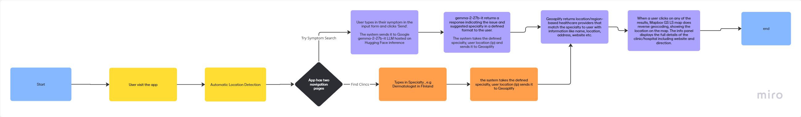

# Purpose of the App (project idea)

FaD (Find a Doctor) is a healthcare web application that helps users search for nearby clinics, hospitals, or doctors based on their symptoms or specialty. The app uses AI to interpret natural language input (e.g. "I've been feeling pain on the left side of my stomach for weeks now, and it's concerning") and returns relevant medical departments along with location-based recommendations.

It aims to solve problems like:

- Not knowing which specialist to see
- Wanting to see nearby clincs & hospitals
- Searching by symptoms using natural language

### Core Features of the app

- Symptom input (free-text form)
- AI processing (via Google gemma-2-27b-it LLM hosted on Hugging Face inference to identify possible specializations)
- Direct search input (e.g "Dermatologist in Finland")
- Automatic Location Detection via IP or GPS (ipinfo.io or ipapi.com (IP-based geolocation))
- Doctor & clinic results (via Geoaplify /OSM)
- Interactive map view (Mapbox)
- Info panel (clinic details, opening hours, contact etc)

### Target Users

- Locals, Visitors, students, or immigrants wanting fast access to healthcare based on symptoms

## How the App Works (Flowchart illustration using Miro)

Click on the image to view flowchart on the web

### Techinal implementation will include:

- Caching
- Rate Limiting
- Location Filter
- Load map Lazily (after user input)

### Future implementation

- Direct search auto complete using Mapbox Search Box API

## App UI Design draft

### UI sketch on paper

Landing Page

FInd a clinic/Symptom Search UI

# Framer UI Designs

I learned how to use Framer on [Framer/Academy](https://www.framer.com/academy/) and published the design via https://courteous-studies-234530.framer.app/

## Landing Page Design

## Try Symptom Search

## Find a Clinic UI

